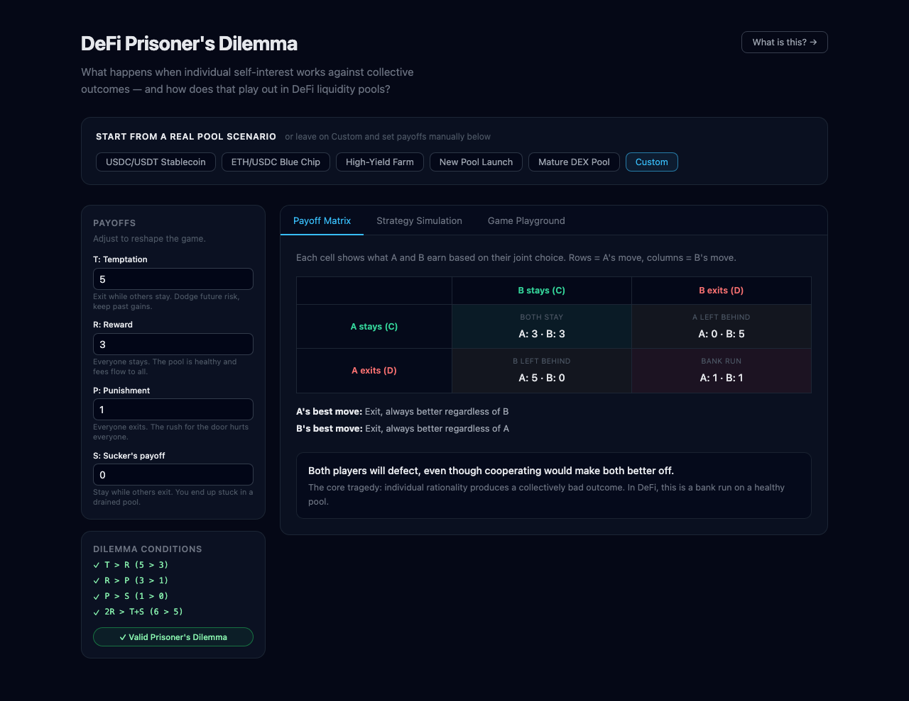
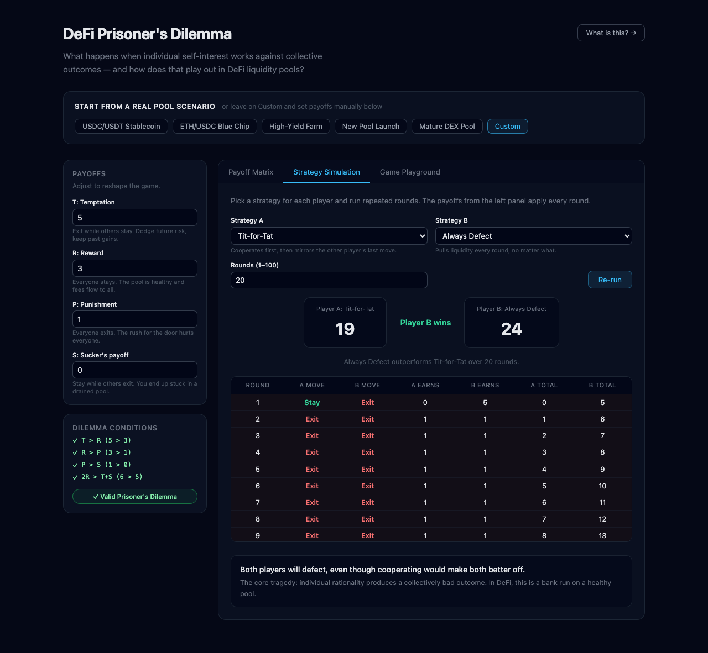
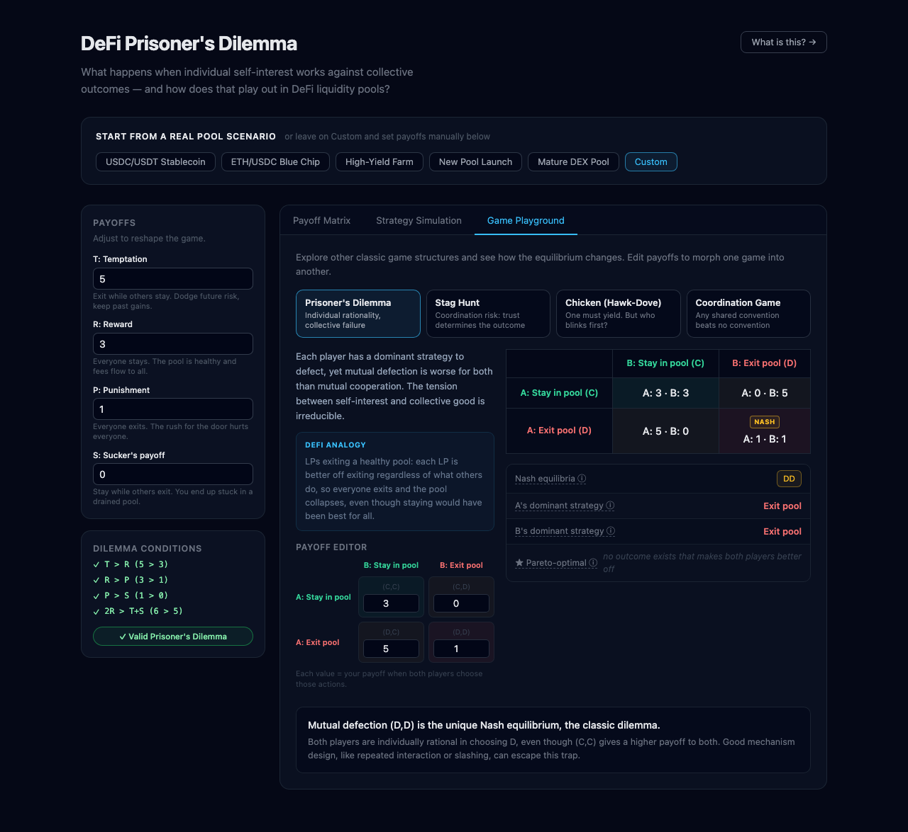

# Game Theory in DeFi: Part 1

An interactive playground that maps classic game theory concepts onto real DeFi mechanics. Tune payoff parameters, run multi-round strategy simulations, and explore how game type changes the equilibrium outcome.

Built with React 18 + TypeScript + Vite. No external UI libraries.

---

## What it covers

### Payoff Matrix

Choose a DeFi pool scenario (e.g. "High-Yield Farm" or "USDC/USDT Stablecoin") or dial in custom payoffs. The app derives T/R/P/S from pool statistics (APR, volatility, whale concentration, investment horizon) and shows you the full 2x2 matrix with dominant strategies and a natural-language verdict.



### Strategy Simulation

Pick two strategies (Always Cooperate, Always Defect, Tit-for-Tat, Grim Trigger, Random) and run up to 50 rounds. Watch cumulative payoffs diverge round by round and see why Tit-for-Tat outperforms Always Defect over time.



### Game Playground

Switch between four canonical 2x2 symmetric games: Prisoner's Dilemma, Stag Hunt, Chicken (Hawk-Dove), and Coordination Game. Each comes with its own default payoffs, DeFi analogy, and equilibrium analysis. Hover the jargon terms for plain-English definitions.



---

## Quickstart

Requirements: Node.js 18+

```bash
npm install
npm run dev
```

Open the `localhost` URL printed in the terminal.

---

## Project structure

```
src/
  game/
    pd.ts          Core Prisoner's Dilemma engine (T/R/P/S analysis)
    strategies.ts  Iterated simulation (N rounds, 5 strategies)
    defi.ts        Pool stats -> payoff mapping + 5 DeFi presets
    games.ts       Generic 2x2 game engine (Nash, Pareto, 4 game types)
  App.tsx          UI: Hero, Scenario Selector, three tabs
  style.css        Layout and component styles
```

---

## Game theory concepts

**Payoffs (T, R, P, S)**

- T (Temptation): you defect while the other cooperates
- R (Reward): both cooperate
- P (Punishment): both defect
- S (Sucker's payoff): you cooperate while the other defects

For a strict Prisoner's Dilemma: T > R > P > S and 2R > T + S. Under these conditions, defecting is a dominant strategy for both players, so (D, D) is the unique Nash equilibrium even though (C, C) would be better for both.

**DeFi mapping**

- Cooperate (C) = stay in the liquidity pool
- Defect (D) = exit the position / pull liquidity
- T = exit while others stay (dodge future impermanent loss, keep past fees)
- R = everyone stays (earn yield, modest IL)
- P = everyone exits (slippage, lost fees, whale exits crash the price)
- S = stay while others exit (stuck in a drained pool, no counterparty depth)

**Strategies in iterated play**

| Strategy | Rule |
|---|---|
| Always Cooperate | C every round |
| Always Defect | D every round |
| Tit-for-Tat | Start C, then mirror the opponent's last move |
| Grim Trigger | Start C, switch to D forever after the first betrayal |
| Random | C or D with equal probability each round |

---

## The four game types

| Game | Nash equilibria | Key tension |
|---|---|---|
| Prisoner's Dilemma | (D, D) unique | Individual rationality beats collective welfare |
| Stag Hunt | (C, C) and (D, D) | Trust determines which equilibrium you land on |
| Chicken | (C, D) and (D, C) | Both defecting is the worst outcome; someone must yield |
| Coordination | (C, C) and (D, D) | No conflict of interest, just a coordination problem |
